## Deployment

### Local Deployment

To run the project locally, install:
- [Python3](https://www.python.org/downloads) to run the app
- [PIP](https://pip.pypa.io/en/stable/installation/) to install all app requirements
- [Microsoft Visual Studio Code](https://code.visualstudio.com)
- [GIT](https://www.atlassian.com/git/tutorials/install-git) for version control
- [MongoDB Atlas](https://www.mongodb.com) to develop the database

For local deployment:

- Clone this GitHub repository by clicking the green `Code` button and `Download ZIP` to download a copy of the project as a zip-file

- Unzip the file

- Navigate to the correct file location after unpacking the files
    - `cd <path to folder>`

- Create a `env.py` file with your credentials. 

	<h2 align="left">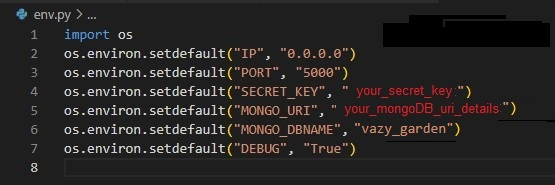</h2>

- Install all requirements from the requirements.txt file using this command:
    - `sudo -H pip3 -r requirements.txt`

	<h2 align="left">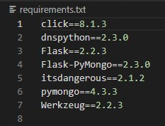</h2>

- Sign up for a free account on [MongoDB](https://www.mongodb.com/Atlas) and create a new Database called **vazy_garden**. The *Collections* (tables) in that database should be as follows:

**plants**
```
_id: <ObjectId>
category_name: <string>
plant_name: <string>
plant_description: <string>
sow: <string>
is_edible: <string>
is_done: <string>
animal_name: <string>
link: <string>
seed_link: <string>
created_by: <string>
```

**categories**
```
_id: <ObjectId>
category_name: <string>
```

**months**
```
_id: <ObjectId>
sow: <string>
```

**animals**
```
_id: <ObjectId>
animal_name: <string>
```

**users**
```
_id: <ObjectId>
username: <string>
password: <string>
```

- Launch the app typing the following command in the terminal:
    - `flask run`
- The app should run on *localhost* on an address similar to `http://127.0.0.1:5000`. More information [here](https://code.visualstudio.com/docs/python/tutorial-flask).

### Remote Deployment

This site is currently deployed on [Heroku](https://www.heroku.com/) using the **main** branch on GitHub. To implement this project on Heroku, the following steps were taken:

1. Create a **requirements.txt** file so Heroku can install the required dependencies to run the app.
    - `sudo pip3 freeze --local > requirements.txt`

	<h2 align="left"></h2>

2. Create a **Procfile** to tell Heroku that this is a Python app
    - `echo web: python app.py > Procfile`

	<h2 align="left">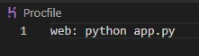</h2>

	- Make sure there are no blanks lines at the end of the file!

3. Sign up for a free [Heroku](https://www.heroku.com/) account

    - Create a new app

	<h2 align="left">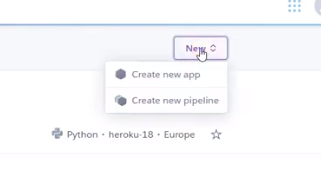</h2>

    - Click the **Deploy** tab 

	<h2 align="left"></h2>

    - Go to Deployment Method section and click *Connect GitHub*

	<h2 align="left">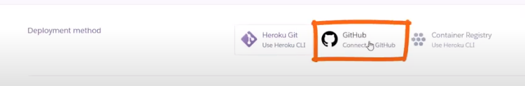</h2>

    - Make sure your GitHub profile is displayed and add the repository name. Once your repository is found, click to connect

	<h2 align="left">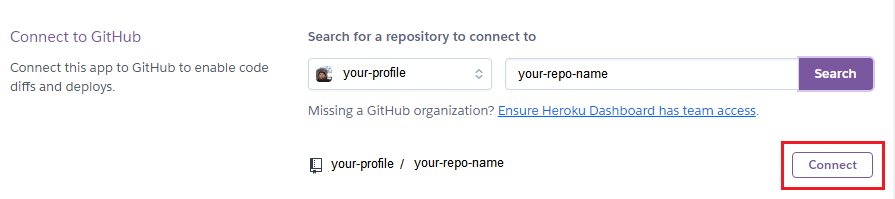</h2>

    - Once connected, you should see

	<h2 align="left">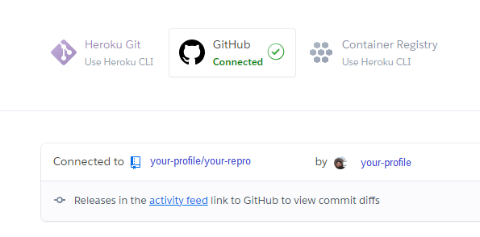</h2>

    -  Select **Enable Automatic Deploys** button 

	<h2 align="left">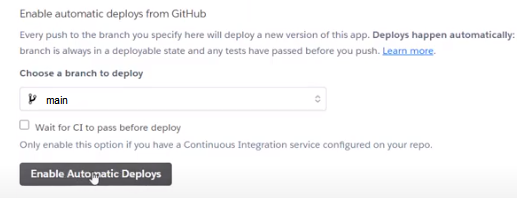</h2>
    
    - After which you should see

	<h2 align="left">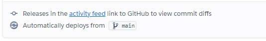</h2>

4. Click on **Settings** tab, then click on **Reveal Config Vars**. 

	<h2 align="left">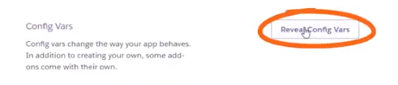</h2>

- Now we can securely tell Heroku which variables are required by the env.py file. 
Configure the environmental variables as follows:

    - **IP** : 0.0.0.0
    - **PORT** : 5000
    - **SECRET_KEY** : <your_own_secret_key>
    - **MONGO_URI** : <link_to_your_MongoDB>
    - **MONGO_DBNAME** : vazy_garden
    - **DEBUG** : False

5. Go back to **Deploy** tab and navigate to **Deploy a GitHub branch**. Click **Deploy Branch** button. Once the app has been built, you can **View** it.

	<h2 align="left">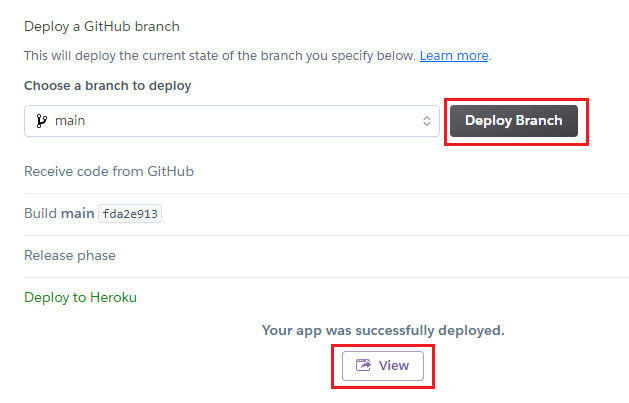</h2>

