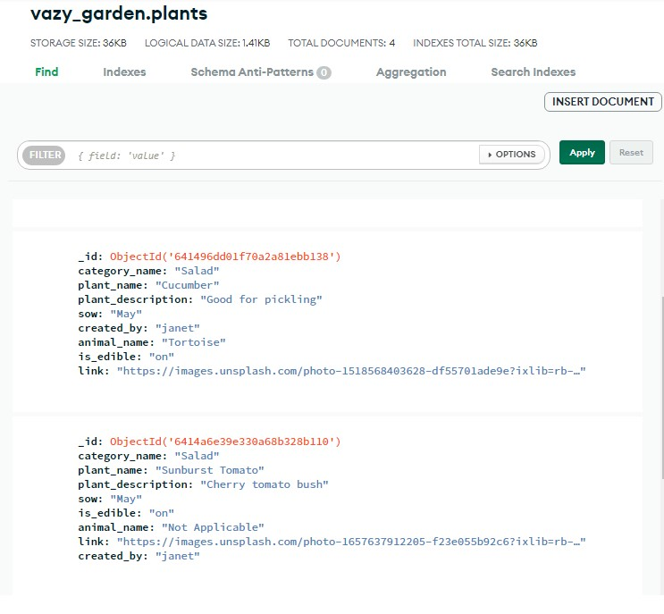
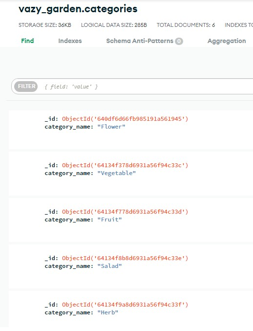
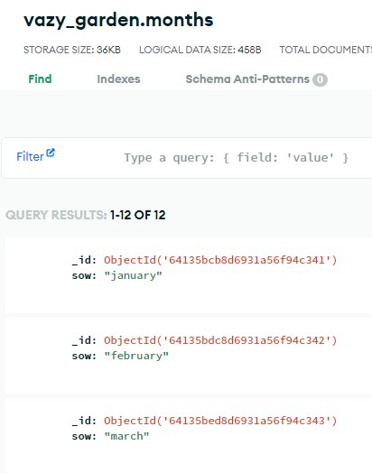
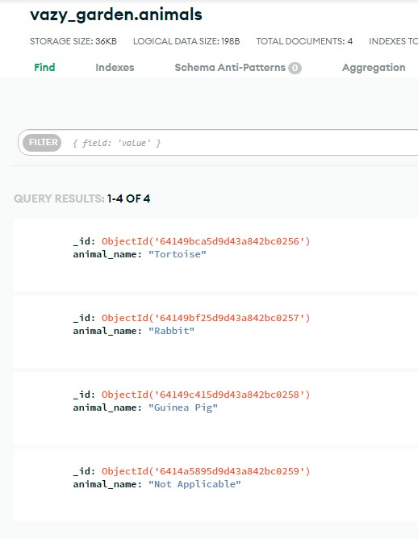
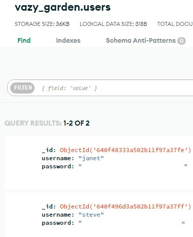

## Project Purpose

This is a Code Institute student project for Milestone 3, built to satisfy the requirements for the EKC DigitalLearn Diploma (Level 5) in [Web Application Development](https://www.ekcgroup.ac.uk/ekc-digitallearn/computing/web-application-development-diploma). 

This project has been created in order to provide a community CRUD application on a deployed interactive website. The project was built using **Gitpod**. 

The information has been presented in a way that ensures the users achieve their goals of:
* understanding what the site's function is
* understanding how to create, read, update and delete their own records or posts
* being able to eregister, log in and log out of this community site

The site also enhances the owner's goals by:
* showcasing their database design skills
* showcasing their Python programming skills
* showcasing their Flask skills
* showcasing their back-end development skills by allowing users to change data in a MongoDB database with the aid of the Flask mini-framework.

## Project Requirements

* The technologies used were HTML, CSS, **Python, Flask and MongoDB**.
* This interactive back-end project contains pages to enable users to create, read, update and delete user records in a non-relational database
* This README.md file explains what the project does and the value it provides for the users
* Version control is provided by Git and GitHub
* External code, libraries, templates, images, information, etc. will be listed in the **Credits**, at the bottom of this README.
* This project is deployed via **Heroku**. The code stored in a GitHub repository, whilst the data is stored in **MongoDB Atlas**.

<h1 align="left">Flask App with MongoDB: Vazy Garden</h1>

[View the live project here.](https://vazy-garden.herokuapp.com/)

The aim of the project is to provide a community site for garden and allotment enthusiasts. Users will be able to log in to create records for plants they wish to cultivate. It will be designed to aid the user in deciding which seeds to sow in a particular month. They will also be able to add if the plants are for pet or animal food. On the home page users will be able to see everyone's entries but on their own profile page they will only be able to view their own plants.

The site is designed to be responsive and accessible on a range of devices, making it easy to use for potential users.

<h2 align="left"></h2>

## User Experience (UX)

### User stories

As this is a brand new site with limited features, so the user stories were taken from the perspective of the visiting or anonymous user. We don't have any traffic data yet and we don't really know who are users are at this point.
* As a visiting user, I would like to create, read, update and delete my own plant records.
* As a visiting user, I would like to easily understand how to use the site.
* As a visiting user, I would like to keep my information secure.
* As a visiting user, I would like to see other users' records.

### Owner goals

* I would like to build a Flask app.
* I would like to allow users to store their data via the app.
* I would like to build a community gardening app to also assist pet owners.
* I would like the ap to be visually attractive and fun to use.

### Design

### Wireframes

Mobile

Tablet [wireframes](docs/ux/wireframe-mp3.pdf)

Desktop

### Non-Relational Database - MongoDB

Tables (Collections)

* Plants
<h2 align="left"></h2>

* Categories
<h2 align="left"></h2>

* Months
<h2 align="left"></h2>

* Animals
<h2 align="left"></h2>

* Users
<h2 align="left"></h2>

## Gitpod Reminders

To run a backend Python file, type `python3 app.py`, if your Python file is named `app.py` of course.

A blue button should appear to click: _Make Public_,

Another blue button should appear to click: _Open Browser_.

In Gitpod you have superuser security privileges by default. Therefore you do not need to use the `sudo` (superuser do) command in the bash terminal.

To log into the Heroku toolbelt CLI:

1. Log in to your Heroku account and go to *Account Settings* in the menu under your avatar.
2. Scroll down to the *API Key* and click *Reveal*
3. Copy the key
4. In Gitpod, from the terminal, run `heroku_config`
5. Paste in your API key when asked

You can now use the `heroku` CLI program - try running `heroku apps` to confirm it works. This API key is unique and private to you so do not share it. If you accidentally make it public then you can create a new one with _Regenerate API Key_.

## Credits

A huge thank you to the following people and organisations, because without you, the website would not have been produced in it's present form.

### From the Course

Sample README and GitHub deployment instructions from [Code Institute](https://github.com/Code-Institute-Solutions/SampleREADME)

Markdown Cheatsheet from [Adam Pritchard](https://github.com/adam-p/markdown-here/wiki/Markdown-Cheatsheet#html)

### Media

Plant images from [Dean Lewis](https://unsplash.com/@infinitecreations21) on Unsplash

Cucumber plant image from [Kelly Neil](https://unsplash.com/@baconandbaileys) on Unsplash

### Code

Although the code is the work of the author, some of the code has been sourced from or inspired by others.

Many of the references have been embedded as links throughout this document and indicated by the active blue text links.

## Acknowledgements

Rohit Sharma - [Code Institute](https://codeinstitute.net/) Mentor, for the continuous feedback and guidance in industry standards.

Rachel Furlong - [EKC DigitalLearn](https://ekcgroup.ac.uk/business-units/ekc-digitallearn) Course Facilitator, for generous support and advice.
 