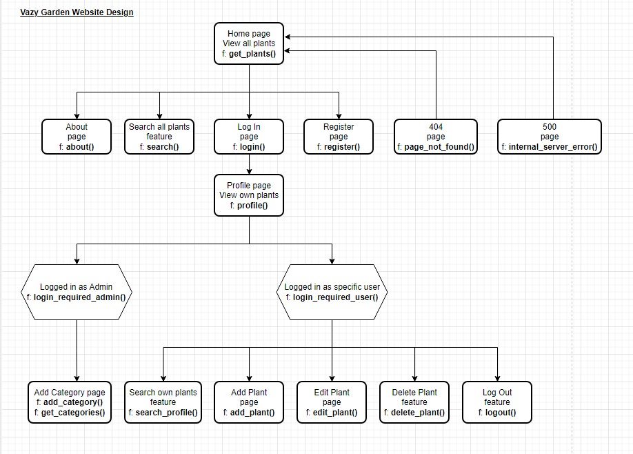
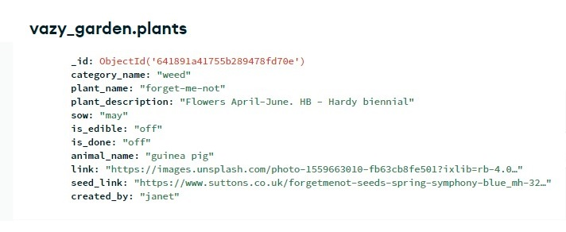
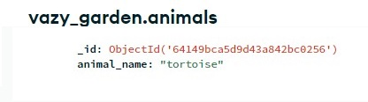
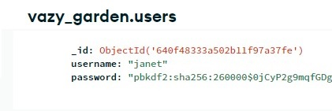

## Project Purpose

This is a Code Institute student project for Milestone 3, built to satisfy the requirements for the EKC DigitalLearn Diploma (Level 5) in [Web Application Development](https://www.ekcgroup.ac.uk/ekc-digitallearn/computing/web-application-development-diploma). 

This project has been created in order to provide a community CRUD application on a deployed interactive website. The project was built using **Gitpod**. 

The information has been presented in a way that ensures the users achieve their goals of:
* understanding what the site's function is
* understanding how to create, read, update and delete their own records or posts
* being able to eregister, log in and log out of this community site

The site also enhances the owner's goals by:
* showcasing their database design skills
* showcasing their Python programming skills
* showcasing their Flask skills
* showcasing their back-end development skills by allowing users to change data in a MongoDB database with the aid of the Flask mini-framework.


## Project Requirements

* The technologies used were HTML, CSS, **Python, Flask and MongoDB**.
* This interactive back-end project contains pages to enable users to create, read, update and delete user records in a non-relational database
* This README.md file explains what the project does and the value it provides for the users
* Version control is provided by Git and GitHub
* External code, libraries, templates, images, information, etc. will be listed in the **Credits**, at the bottom of this README.
* This project is deployed via **Heroku**. The code stored in a GitHub repository, whilst the data is stored in **MongoDB Atlas**.


<h1 align="left">Flask App with MongoDB: Vazy Garden</h1>

[View the live project here.](https://vazy-garden.herokuapp.com/)

The aim of the project is to provide a community site for garden and allotment enthusiasts. Users will be able to log in to create records for plants they wish to cultivate. It will be designed to aid the user in deciding which seeds to sow in a particular month. They will also be able to add if the plants are for pet or animal food. On the home page users will be able to see everyone's entries but on their own profile page they will only be able to view their own plants.

The site is designed to be responsive and accessible on a range of devices, making it easy to use for potential users.

<h2 align="left"></h2>


## User Experience (UX)

### User stories

As this is a brand new site with limited features, so the user stories were taken from the perspective of the visiting or anonymous user. We don't have any traffic data yet and we don't really know who are users are at this point.
* As a visiting user, I would like to create, read, update and delete my own plant records.
* As a visiting user, I would like to easily understand how to use the site.
* As a visiting user, I would like to keep my information secure.
* As a visiting user, I would like to see other users' records.

### Owner goals

* I would like to build a Flask app.
* I would like to allow users to store their data via the app.
* I would like to build a community gardening app to also assist pet owners.
* I would like the app to be visually attractive and fun to use.

### Design

#### The CRUD App

- This app was inspired by the Code Institute backend development tutorial for a [Task Manager](https://github.com/Code-Institute-Solutions/TaskManagerAuth), by Tim Nelson.

- What is a CRUD app? This type of app allows the user to create, read, update and delete records or posts in a database via graphical interface. In this case the database is [MongoDB Atlas 5.0.15](https://www.mongodb.com/atlas) and as the app is developed with [Python 3.8.11](https://www.python.org/downloads/release/python-3811/), the graphical interface is provided by HTML5 and the mini-framework, [Flask 2.2](https://flask.palletsprojects.com/en/2.2.x/) with [Materialize CSS 1.0.0](https://materializecss.com/).

- Why this app? Our household has an allotment and every year in the early spring, we excitely purchase lots of seeds for pretty flowers and delicious vegetables. These precious packets are then stored in a 'safe place' until the time comes for sowing. As usual - out of sight, out of mind - these seeds get forgotten about until it is too late. So I developed this app for like minded folk - here we can create our plant seed posts stating in which month they can be sown. A search facility on keywords allows the user to both search their own entries and others. The home does not require login, but profile pages do. All entries are visible to every one, but only the post owner can edit or delete them. 

- View the website design flowchart to see which Python functions are associated with which web pages of the app:

<h2 align="left"></h2>

Flask uses the route() decorator to bind a function to a URL. For example:
```Python
@app.route('/')
def index():
    return 'Index Page'
```

#### Colour Scheme

The following Materialize [colour scheme](https://materializecss.com/color.html) was chosen for simplicity and readability.

<h2 align="left"></h2>

#### Typography

Roboto is the standard font used by Materialize.

### Wireframes

Mobile

Tablet [wireframes](docs/ux/wireframe-mp3.pdf)

Desktop

### Non-Relational Database - MongoDB

Database Entity Relationship Diagram

<h2 align="left"></h2>

Tables (Collections)

* Plants
<h2 align="left"></h2>

* Categories
<h2 align="left"></h2>

* Months
<h2 align="left"></h2>

* Animals
<h2 align="left"></h2>

* Users
<h2 align="left"></h2>


## Features

### Navigation

### Home Page

### About

### Log In

### Register

### Profile

### Add Plant

### Add Category

### Log Out

### 404 Page


## Future Features


## Technology Used

* [HTML5](https://en.wikipedia.org/wiki/HTML5) and [CSS3](https://en.wikipedia.org/wiki/CSS) for building and custom styling the site.
* [JavaScript](https://www.w3schools.com/js/js_history.asp) which is used to make the web pages interactive.
* [Python](https://www.python.org/) is a high-level, general-purpose programming language.
* [Flask](https://flask.palletsprojects.com/en/2.2.x/) is a micro web framework written in Python.
* [Materialize CSS](https://materializecss.com/) is a modern responsive CSS framework based on Material Design by Google.
* [MongoDB Atlas](https://www.mongodb.com/atlas) is a source-available cross-platform document-oriented database program.
* Wireframes from [Balsamiq](https://balsamiq.com/).
* Developer platform from [Gitpod](https://www.gitpod.io/).
* IDE integrated into Gitpod from [Visual Studio Code](https://code.visualstudio.com/).
* Debugging assisted by [Chrome Developer Tools](https://developer.chrome.com/docs/devtools/).
* Version control integrated into Gitpod from [Git](https://git-scm.com/).
* Project deployment provided by [Heroku](https://www.heroku.com/home).
* Roboto font from [Materialize](https://fonts.google.com/specimen/Roboto).
* Colour palette generated by [Materialize](https://materializecss.com/color.html).
* Icon library and toolkit from [Font Awesome 5](https://fontawesome.com/).
* Favicon created on [favicon.cc](https://www.favicon.cc/).
* Online photo editor from [Pixlr](https://pixlr.com/x/).
* Stock photos from [Unsplash](https://unsplash.com).
* Paint from [Microsoft](https://apps.microsoft.com/store/detail/paint/9PCFS5B6T72H?hl=en-us&gl=us)
* Snip and Sketch from [Microsoft](https://apps.microsoft.com/store/detail/snipping-tool/9MZ95KL8MR0L?hl=en-gb&gl=gb)
* PDF Reader from [Adobe Acrobat Reader](https://www.adobe.com/uk/)
* Flowchart by [diagrams.net/draw.io](https://www.diagrams.net/)
* MongoDB ERD created by [DbSchema](https://dbschema.com/)
* HTML validation from [W3C](https://validator.w3.org/#validate_by_input).
* CSS validation from [Jigsaw (W3C)](https://jigsaw.w3.org/css-validator/).
* Python validation from [Pylint](https://pypi.org/project/pylint/)
* Web page quality improvements assisted by [Lighthouse](https://developer.chrome.com/docs/lighthouse/overview/).
* Web Accessibility Evaluation Tools by [WAVE](https://wave.webaim.org/)


## Testing

See the document [TESTING.md](TESTING.md) for the code validation, automated and manual tests.


## Deployment

See the document [DEPLOYMENT.md](DEPLOYMENT.md) for local and Heroku deployment.


## Gitpod Reminders

To run a backend Python file, type `python3 app.py`, if your Python file is named `app.py` of course.

A blue button should appear to click: _Make Public_,

Another blue button should appear to click: _Open Browser_.

In Gitpod you have superuser security privileges by default. Therefore you do not need to use the `sudo` (superuser do) command in the bash terminal.

To log into the Heroku toolbelt CLI:

1. Log in to your Heroku account and go to *Account Settings* in the menu under your avatar.
2. Scroll down to the *API Key* and click *Reveal*
3. Copy the key
4. In Gitpod, from the terminal, run `heroku_config`
5. Paste in your API key when asked

You can now use the `heroku` CLI program - try running `heroku apps` to confirm it works. This API key is unique and private to you so do not share it. If you accidentally make it public then you can create a new one with _Regenerate API Key_.


## Credits

A huge thank you to the following people and organisations, because without you, the website would not have been produced in it's present form.

### From the Course

Sample README from [Code Institute](https://github.com/Code-Institute-Solutions/SampleREADME)

Heroku deployment instructions from Code Institute video tutorial

Markdown Cheatsheet from [Adam Pritchard](https://github.com/adam-p/markdown-here/wiki/Markdown-Cheatsheet#html)

### Media

Plant images from [Dean Lewis](https://unsplash.com/@infinitecreations21) on Unsplash

Cucumber plant image from [Kelly Neil](https://unsplash.com/@baconandbaileys) on Unsplash

Forget-me-not image from [Noah Boyer](https://unsplash.com/@emerald_) on Unsplash

Barley field image from [Kai Pilger](https://unsplash.com/@kaip) on Unsplash

Pineapple wearing sunglasses from [Heather Ford](https://unsplash.com/@the_modern_life_mrs) on Unsplash

Wallpaper for 404 page from [Maxim Berg](https://unsplash.com/@maxberg) on Unsplash

### Code

Although the code is the work of the author, some of the code has been sourced from or inspired by others.

Many of the references have been embedded as links throughout this document and indicated by the active blue text links.

Adding custom validation to Materialize dropdown by [Tim Nelson](https://github.com/Code-Institute-Solutions/TaskManagerAuth/blob/main/04-AddingATask-WritingToTheDatabase/02-materialize-select-validation/static/js/script.js)

## Acknowledgements

Rohit Sharma - [Code Institute](https://codeinstitute.net/) Mentor, for the continuous feedback and guidance in industry standards.

Rachel Furlong - [EKC DigitalLearn](https://ekcgroup.ac.uk/business-units/ekc-digitallearn) Course Facilitator, for generous support and advice.
 