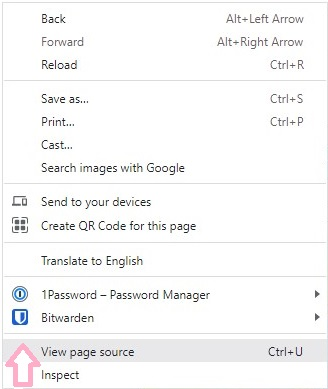

# Manual Testing

**The site was built, tested and validated on the [Chrome browser](docs/pictures/chrome.jpg) only.**

---

## Table of Contents

1. [**Supported Browsers and Screen Sizes**](#supported-browsers-and-screen-sizes)
2. [**Code Validation**](#code-validation)
3. [**Site Audit**](#site-audit)
4. [**Compatibility**](#compatibility)
5. [**Bugs Found**](#bugs-found)
6. [**Known Issues**](#known-issues)

[**Back to README**](README.md)

---

## Supported Browsers and Screen Sizes

Materialize v1.0.0 was used for building the site - see the [supported browsers](https://github.com/Dogfalo/materialize).
* Materialize is compatible with:
    - Chrome 35+
    - Firefox 31+
    - Safari 9+
    - Opera
    - Edge
    - IE 11+

* Devices supported:
    - Mac
    - Windows
    - Android
    - iOS

* The Materialize standard grid has 12 columns. No matter the size of the browser, each of these columns will always have an equal width. See the section [Creating Responsive Layouts](https://materializecss.com/grid.html) in the Materialize documentation on how to design the layouts so that they look great on all screen sizes. 

    | Device                   | Class Prefix   | Dimensions |
    | ------------------------ | -------------- | ---------- |
    | Mobile                   | .s             | <=600px    |
    | Tablet                   | .m             | > 600px    |
    | Desktop                  | .l             | > 992px    |
    | Large Desktop            | .xl            | > 1200px   |

---

## Code Validation
* HTML - No errors or warnings were detected by [W3C](https://validator.w3.org/#validate_by_input) Validation for pages:
    - [get_plants.html PDF report](docs/testing/validation/w3c-html-get_plants.pdf)
    - [about.html PDF report](docs/testing/validation/w3c-html-about.pdf)
    - [profile.html PDF report](docs/testing/validation/w3c-html-profile.pdf)
    - [add_plant.html PDF report](docs/testing/validation/w3c-html-add_plant.pdf)
    - [edit_plant.html PDF report](docs/testing/validation/w3c-html-edit_plant.pdf)
    - [delete_plant.html PDF report](docs/testing/validation/w3c-html-delete_plant.pdf)
    - [categories.html PDF report](docs/testing/validation/w3c-html-categories.pdf)
    - [add_category.html PDF report](docs/testing/validation/w3c-html-add_category.pdf)
    - [register.html PDF report](docs/testing/validation/w3c-html-register.pdf)
    - [login.html PDF report](docs/testing/validation/w3c-html-login.pdf)
    - [404.html PDF report](docs/testing/validation/w3c-html-404.pdf)
    - [500.html PDF report](docs/testing/validation/w3c-html-500.pdf)

    <h2 align="left"></h2>

    HTML with Jinja2 code will cause errors in the validator. A quick fix is to: 
    - right-click the live page and 
    - select "View page source" instead of "Inspect"
    <h2 align="left"></h2>
    this will open a new tab with the generated code for easy copying and pasting into the validator.
    
    Credit: [Jo Heyndels](https://www.linkedin.com/in/joke-heyndels/), Learning Success Executive at Code Institute

* CSS - No errors or warnings were detected by [Jigsaw (W3C)](https://jigsaw.w3.org/css-validator/#validate_by_input) Validation for:
    - [style.css PDF report](docs/testing/validation/w3c-css.pdf)

    <h2 align="left"></h2>

* JavaScript - No errors or warnings were detected by [JSHint](https://jshint.com/) for script.js:

    <h2 align="left"></h2>

* Python - No errors or warnings were detected by [CI Python Linter](https://pep8ci.herokuapp.com/) for: 
    - app.py

    <h2 align="left"></h2>

    - decorators.py

    <h2 align="left"></h2>

---

## Site Audit

### Desktop audits

* [Lighthouse](https://developer.chrome.com/docs/lighthouse/overview/) minimum scores:

    <h2 align="left"></h2>

    Full PDF reports:

    - [get_plants.html report](docs/testing/audit/lighthouse-get-plants-desktop.pdf)
    - [about.html report](docs/testing/audit/lighthouse-about-desktop.pdf)
    - [profile.html report](docs/testing/audit/lighthouse-profile-desktop.pdf)    
    - [add_plant.html report](docs/testing/audit/lighthouse-add-plant-desktop.pdf)
    - [edit_plant.html report](docs/testing/audit/lighthouse-edit-plant-desktop.pdf)
    - [delete_plant.html report](docs/testing/audit/lighthouse-delete-plant-desktop.pdf)
    - [categories.html report](docs/testing/audit/lighthouse-get-categories-desktop.pdf)    
    - [add_category.html report](docs/testing/audit/lighthouse-add-category-desktop.pdf)
    - [register.html report](docs/testing/audit/lighthouse-register-desktop.pdf)
    - [login.html report](docs/testing/audit/lighthouse-login-desktop.pdf)

    - 404.html report - Lighthouse was unable to generate this:.

    <h2 align="left"></h2>

    - Used **WebPageTest** instead - see the article [Why you should be testing your 404 pages web performance](https://nooshu.com/blog/2020/08/25/you-should-be-testing-your-404-pages-web-performance/) by Matt Hobbs on Nooshu.com

* [WebPageTest](https://www.webpagetest.org/) summary:

    <h2 align="left"></h2>

    Full PDF reports:

    - [404.html report](docs/testing/audit/webpagetest-404-desktop.pdf)
    - [500.html report](docs/testing/audit/webpagetest-500-desktop.pdf)

### Mobile audits

* [Lighthouse](https://developer.chrome.com/docs/lighthouse/overview/) minimum scores:

    <h2 align="left"></h2>

    Full PDF reports:

    - [get_plants.html report](docs/testing/audit/lighthouse-get-plants-mobile.pdf)
    - [about.html report](docs/testing/audit/lighthouse-about-mobile.pdf)
    - [profile.html report](docs/testing/audit/lighthouse-profile-mobile.pdf)    
    - [add_plant.html report](docs/testing/audit/lighthouse-add-plant-mobile.pdf)
    - [edit_plant.html report](docs/testing/audit/lighthouse-edit-plant-mobile.pdf)
    - [delete_plant.html report](docs/testing/audit/lighthouse-delete-plant-mobile.pdf)
    - [categories.html report](docs/testing/audit/lighthouse-get-categories-mobile.pdf)    
    - [add_category.html report](docs/testing/audit/lighthouse-add-category-mobile.pdf)
    - [register.html report](docs/testing/audit/lighthouse-register-mobile.pdf)
    - [login.html report](docs/testing/audit/lighthouse-login-mobile.pdf)

* [WebPageTest](https://www.webpagetest.org/) summary:

    <h2 align="left"></h2>

    Full PDF reports:

    - [404.html report](docs/testing/audit/webpagetest-404-mobile.pdf)
    - [500.html report](docs/testing/audit/webpagetest-500-mobile.pdf)

---

## Compatibility

The majority of testing and validation was carried out on the Chrome browser with a Windows 10 desktop, but to ensure that a broad range of users can successfully use this site, it was also tested with other browsers in both desktop and mobile configuration.

- Chrome v.112
- Edge v.18
- Firefox v.106
- Safari v.13
- Opera v.97

The results are shown below in a testing matrix:

<h2 align="left"></h2>

The original Excel version created by Tim Nelson, can be found [here](https://github.com/TravelTimN/ci-milestone04-dcd/blob/main/app/testing/testing-ci-milestone04-dcd.xlsx).

---

## Bugs Found

---

## Known Issues
