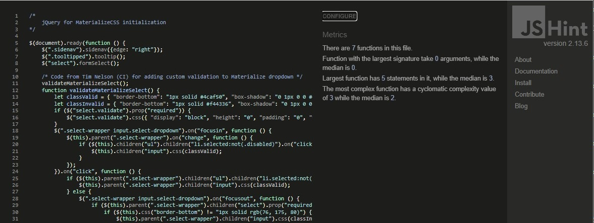
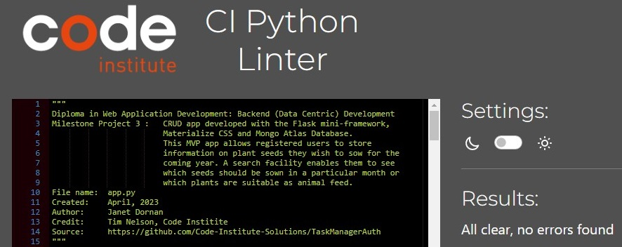

# Project Testing

## Manual Testing

**The site was built, tested and validated on the [Chrome browser](docs/testing/chrome-win10.jpg) only.**

### Supported Browsers and Screen Sizes

Materialize v1.0.0 was used for building the site - see the [supported browsers](https://github.com/Dogfalo/materialize).
* Materialize is compatible with:
    - Chrome 35+
    - Firefox 31+
    - Safari 9+
    - Opera
    - Edge
    - IE 11+

* Devices supported:
    - Mac
    - Windows
    - Android
    - iOS

* The Materialize standard grid has 12 columns. No matter the size of the browser, each of these columns will always have an equal width. See the section [Creating Responsive Layouts](https://materializecss.com/grid.html) in the Materialize documentation on how to design the layouts so that they look great on all screen sizes. 

    | Device                   | Class Prefix   | Dimensions |
    | ------------------------ | -------------- | ---------- |
    | Mobile                   | .s             | <=600px    |
    | Tablet                   | .m             | > 600px    |
    | Desktop                  | .l             | > 992px    |
    | Large Desktop            | .xl            | > 1200px   |

### Code Validation
* HTML - No errors or warnings were detected by [W3C](https://validator.w3.org/#validate_by_input) Validation for pages:
    - [get_plants.html PDF report](docs/testing/validation/w3c-html-get_plants.pdf)
    - [about.html PDF report](docs/testing/validation/w3c-html-about.pdf)
    - [profile.html PDF report](docs/testing/validation/w3c-html-profile.pdf)
    - [add_plant.html PDF report](docs/testing/validation/w3c-html-add_plant.pdf)
    - [edit_plant.html PDF report](docs/testing/validation/w3c-html-edit_plant.pdf)
    - [delete_plant.html PDF report](docs/testing/validation/w3c-html-delete_plant.pdf)
    - [categories.html PDF report](docs/testing/validation/w3c-html-categories.pdf)
    - [add_category.html PDF report](docs/testing/validation/w3c-html-add_category.pdf)
    - [register.html PDF report](docs/testing/validation/w3c-html-register.pdf)
    - [login.html PDF report](docs/testing/validation/w3c-html-login.pdf)
    - [404.html PDF report](docs/testing/validation/w3c-html-404.pdf)
    - [500.html PDF report](docs/testing/validation/w3c-html-500.pdf)

    <h2 align="left"></h2>

    HTML with Jinja2 code will cause errors in the validator. A quick fix is to: 
    - right-click the live page and 
    - select "View page source" instead of "Inspect"
    <h2 align="left"></h2>
    this will open a new tab with the generated code for easy copying and pasting into the validator.
    
    Credit: [Jo Heyndels](https://www.linkedin.com/in/joke-heyndels/), Learning Success Executive at Code Institute

* CSS - No errors or warnings were detected by [Jigsaw (W3C)](https://jigsaw.w3.org/css-validator/#validate_by_input) Validation for:
    - [style.css PDF report](docs/testing/validation/w3c-css.pdf)

    <h2 align="left"></h2>

* JavaScript - No errors or warnings were detected by [JSHint](https://jshint.com/) for script.js:

    <h2 align="left"></h2>

* Python - No errors or warnings were detected by [CI Python Linter](https://pep8ci.herokuapp.com/) for: 
    - app.py

    <h2 align="left"></h2>

    - decorators.py

    <h2 align="left"></h2>

### Site Audit

Desktop audits by

* Lighthouse:
    - [get_plants.html report](docs/testing/audit/lighthouse-get-plants-desktop.pdf)

    <h2 align="left"></h2>

    - [about.html report](docs/testing/audit/lighthouse-about-desktop.pdf)

    <h2 align="left"></h2>

    - [profile.html report](docs/testing/audit/lighthouse-profile-desktop.pdf)

    <h2 align="left"></h2>
    
    - [add_plant.html report](docs/testing/audit/lighthouse-add-plant-desktop.pdf)

    <h2 align="left"></h2>

    - [edit_plant.html report](docs/testing/audit/lighthouse-edit-plant-desktop.pdf)

    <h2 align="left"></h2>

    - [delete_plant.html report](docs/testing/audit/lighthouse-delete-plant-desktop.pdf)

    <h2 align="left"></h2>

    - [categories.html report](docs/testing/audit/lighthouse-get-categories-desktop.pdf)

    <h2 align="left"></h2>
    
    - [add_category.html report](docs/testing/audit/lighthouse-add-category-desktop.pdf)

    <h2 align="left"></h2>

    - [register.html report](docs/testing/audit/lighthouse-register-desktop.pdf)

    <h2 align="left"></h2>

    - [login.html report](docs/testing/audit/lighthouse-login-desktop.pdf)

    <h2 align="left"></h2>

    - 404.html report - Lighthouse was unable to generate, so used WebPageTest instead
        - See the article [Why you should be testing your 404 pages web performance](https://nooshu.com/blog/2020/08/25/you-should-be-testing-your-404-pages-web-performance/) by Matt Hobbs on Nooshu.com

    <h2 align="left"></h2>

* [WebPageTest](https://www.webpagetest.org/):

    - [404.html report](docs/testing/audit/webpagetest-404-desktop.pdf)

    <h2 align="left"></h2>
