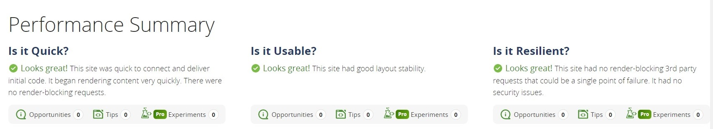
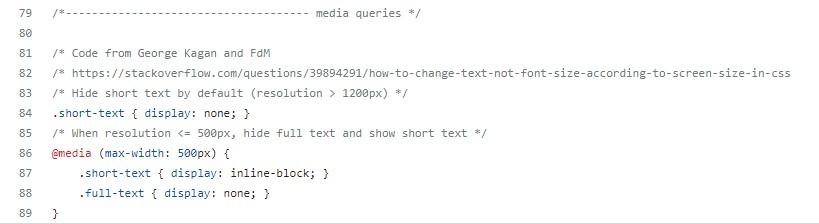
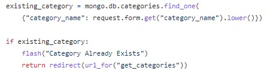

# Manual Testing

**The site was built, tested and validated on the [Chrome browser](docs/pictures/chrome.jpg) only.**

---

## Testing Contents

- [**Supported Browsers and Screen Sizes**](#supported-browsers-and-screen-sizes)
- [**Testing Against User Stories**](#testing-against-user-stories)
- [**Test Cases**](#test-cases)
- [**Code Validation**](#code-validation)
- [**Site Audit**](#site-audit)
- [**Compatibility**](#compatibility)
- [**Bugs Found**](#bugs-found)
- [**Known Issues**](#known-issues)

Back to [**README.md**](README.md)

---

## Supported Browsers and Screen Sizes

Materialize v1.0.0 was used for building the site - see the [supported browsers](https://github.com/Dogfalo/materialize).
* Materialize is compatible with:
    - Chrome 35+
    - Firefox 31+
    - Safari 9+
    - Opera
    - Edge
    - IE 11+

* Devices supported:
    - Mac
    - Windows
    - Android
    - iOS

* The Materialize standard grid has 12 columns. No matter the size of the browser, each of these columns will always have an equal width. See the section [Creating Responsive Layouts](https://materializecss.com/grid.html) in the Materialize documentation on how to design the layouts so that they look great on all screen sizes. 

    | Device                   | Class Prefix   | Dimensions |
    | ------------------------ | -------------- | ---------- |
    | Mobile                   | .s             | <=600px    |
    | Tablet                   | .m             | > 600px    |
    | Desktop                  | .l             | > 992px    |
    | Large Desktop            | .xl            | > 1200px   |

---

## Testing Against User Stories

"**_As a user, I would like to_** _____________________________"

- *create, read, update and delete my own plant records*
    - All logged-on users are able to view, add, edit or delete their own plants via appropriate pages:
        - View
        <h2 align="left"></h2>
        - Add
        <h2 align="left"></h2>
        - Edit or delete
        <h2 align="left"></h2>
        - Edit
        <h2 align="left"></h2>
        - Delete
        <h2 align="left"></h2>

- *easily understand how to use the site*
    - Instructions on how to use the site are detailed on the **About** page.
    <h2 align="left"></h2>

- *keep my information secure*
    - Users need to register with a unique username and password. 

    <h2 align="left"></h2>

    - Passwords are hashed for security purposes by Werkzeug. This is a comprehensive [WSGI](https://wsgi.readthedocs.io/en/latest/) (Web Server Gateway Interface) web application library.

    - Further security is provided by defensive programming and Flask login-decorators. There are two decorators for this site; one for users and another for the administrator. These decorators 'wrap' the user/administrator editing functions and check if they are in fact the owner of the records:
        - User login decorator for the profile page.

        <h2 align="left"></h2>

        The same decorator is used for the *log out / add plant* pages
        - Administrator login decorator for the category page.

        <h2 align="left"></h2>

        The same decorator is used for the *add category* page.

    - For the *edit plant / delete plant* pages; a check is made to see if the current session user is the owner of the plant record. If not, they are taken to a 404 page.

    <h2 align="left"></h2>

- *view the site without logging in*
    - Anyone can view all the plants on the home page, without registering or logging in:

    <h2 align="left"></h2>

- *search for plants to feed my pet*
    - Users are able to search on keywords from the fields:
        - plant name
        - plant description
        - set month
        - animal name

    <h2 align="left"></h2>

- *search for plants that I need to set in a particular month*

    <h2 align="left"></h2>

---

## Test Cases

---

## Code Validation
* HTML - No errors or warnings were detected by [W3C](https://validator.w3.org/#validate_by_input) Validation for pages:
    - [get_plants.html PDF report](docs/testing/validation/w3c-html-get_plants.pdf)
    - [about.html PDF report](docs/testing/validation/w3c-html-about.pdf)
    - [profile.html PDF report](docs/testing/validation/w3c-html-profile.pdf)
    - [add_plant.html PDF report](docs/testing/validation/w3c-html-add_plant.pdf)
    - [edit_plant.html PDF report](docs/testing/validation/w3c-html-edit_plant.pdf)
    - [delete_plant.html PDF report](docs/testing/validation/w3c-html-delete_plant.pdf)
    - [categories.html PDF report](docs/testing/validation/w3c-html-categories.pdf)
    - [add_category.html PDF report](docs/testing/validation/w3c-html-add_category.pdf)
    - [register.html PDF report](docs/testing/validation/w3c-html-register.pdf)
    - [login.html PDF report](docs/testing/validation/w3c-html-login.pdf)
    - [404.html PDF report](docs/testing/validation/w3c-html-404.pdf)
    - [500.html PDF report](docs/testing/validation/w3c-html-500.pdf)

    <h2 align="left"></h2>

    HTML with Jinja2 code will cause errors in the validator. A quick fix is to: 
    - right-click the live page and 
    - select "View page source" instead of "Inspect"
    <h2 align="left"></h2>
    this will open a new tab with the generated code for easy copying and pasting into the validator.
    
    Credit: [Jo Heyndels](https://www.linkedin.com/in/joke-heyndels/), Learning Success Executive at Code Institute

* CSS - No errors or warnings were detected by [Jigsaw (W3C)](https://jigsaw.w3.org/css-validator/#validate_by_input) Validation for:
    - [style.css PDF report](docs/testing/validation/w3c-css.pdf)

    <h2 align="left"></h2>

* JavaScript - No errors or warnings were detected by [JSHint](https://jshint.com/) for script.js:

    <h2 align="left"></h2>

* Python - No errors or warnings were detected by [CI Python Linter](https://pep8ci.herokuapp.com/) for: 
    - app.py

    <h2 align="left"></h2>

    - decorators.py

    <h2 align="left"></h2>

---

## Site Audit

### Desktop audits

* [Lighthouse](https://developer.chrome.com/docs/lighthouse/overview/) minimum scores:

    <h2 align="left"></h2>

    Full PDF reports:

    - [get_plants.html report](docs/testing/audit/lighthouse-get-plants-desktop.pdf)
    - [about.html report](docs/testing/audit/lighthouse-about-desktop.pdf)
    - [profile.html report](docs/testing/audit/lighthouse-profile-desktop.pdf)    
    - [add_plant.html report](docs/testing/audit/lighthouse-add-plant-desktop.pdf)
    - [edit_plant.html report](docs/testing/audit/lighthouse-edit-plant-desktop.pdf)
    - [delete_plant.html report](docs/testing/audit/lighthouse-delete-plant-desktop.pdf)
    - [categories.html report](docs/testing/audit/lighthouse-get-categories-desktop.pdf)    
    - [add_category.html report](docs/testing/audit/lighthouse-add-category-desktop.pdf)
    - [register.html report](docs/testing/audit/lighthouse-register-desktop.pdf)
    - [login.html report](docs/testing/audit/lighthouse-login-desktop.pdf)

    - 404.html report - Lighthouse was unable to generate this:.

    <h2 align="left"></h2>

    - Used **WebPageTest** instead - see the article [Why you should be testing your 404 pages web performance](https://nooshu.com/blog/2020/08/25/you-should-be-testing-your-404-pages-web-performance/) by Matt Hobbs on Nooshu.com

* [WebPageTest](https://www.webpagetest.org/) summary:

    <h2 align="left"></h2>

    Full PDF reports:

    - [404.html report](docs/testing/audit/webpagetest-404-desktop.pdf)
    - [500.html report](docs/testing/audit/webpagetest-500-desktop.pdf)

### Mobile audits

* [Lighthouse](https://developer.chrome.com/docs/lighthouse/overview/) minimum scores:

    <h2 align="left"></h2>

    Full PDF reports:

    - [get_plants.html report](docs/testing/audit/lighthouse-get-plants-mobile.pdf)
    - [about.html report](docs/testing/audit/lighthouse-about-mobile.pdf)
    - [profile.html report](docs/testing/audit/lighthouse-profile-mobile.pdf)    
    - [add_plant.html report](docs/testing/audit/lighthouse-add-plant-mobile.pdf)
    - [edit_plant.html report](docs/testing/audit/lighthouse-edit-plant-mobile.pdf)
    - [delete_plant.html report](docs/testing/audit/lighthouse-delete-plant-mobile.pdf)
    - [categories.html report](docs/testing/audit/lighthouse-get-categories-mobile.pdf)    
    - [add_category.html report](docs/testing/audit/lighthouse-add-category-mobile.pdf)
    - [register.html report](docs/testing/audit/lighthouse-register-mobile.pdf)
    - [login.html report](docs/testing/audit/lighthouse-login-mobile.pdf)

* [WebPageTest](https://www.webpagetest.org/) summary:

    <h2 align="left"></h2>

    Full PDF reports:

    - [404.html report](docs/testing/audit/webpagetest-404-mobile.pdf)
    - [500.html report](docs/testing/audit/webpagetest-500-mobile.pdf)

---

## Compatibility

The majority of testing and validation was carried out on the Chrome browser with a Windows 10 desktop, but to ensure that a broad range of users can successfully use this site, it was also tested with other browsers in both desktop and mobile configuration.

- Chrome v.112
- Edge v.18
- Firefox v.106
- Safari v.13
- Opera v.97

The results are shown below in a testing matrix:

<h2 align="left"></h2>

The original Excel version created by Tim Nelson, can be found [here](https://github.com/TravelTimN/ci-milestone04-dcd/blob/main/app/testing/testing-ci-milestone04-dcd.xlsx).

---

## Bugs Found

1. Misalignment of Materialize grid columns

<h2 align="left"></h2>

- Solved by assigning margin-left to 0 

<h2 align="left"></h2>

for both tablet and desktop

<h2 align="left"></h2>

2. Unauthorised access to get_category page

Whilst not logged in, a user was able to access this page by manually typing the url

<h2 align="left"></h2>

- Solved by using a Flask [login required decorator](https://flask.palletsprojects.com/en/2.2.x/patterns/viewdecorators/). This decorator can be found in decorators.py

<h2 align="left"></h2>

it is used to wrap the administrator functions in app.py

<h2 align="left"></h2>

3. Large card image

User was able to add link to a large image

<h2 align="left"></h2>

- Solved by limiting the image size in the CSS

<h2 align="left"></h2>

4. Overflow of branding and logo on mobiles

<h2 align="left"></h2>

- Solved by adding separate media queries for default branding and an abreviated one for mobiles. See post from [George Kagan and FdM](https://stackoverflow.com/questions/39894291/how-to-change-text-not-font-size-according-to-screen-size-in-css) on Stack Overflow

<h2 align="left"></h2>

5. Duplicate categories

<h2 align="left"></h2>

- Solved by converting category text to lowercase before checking if it exists in the database.

<h2 align="left"></h2>

6. Not listing plants in alphabetical order

<h2 align="left"></h2>

- Solved by converting the plant name to lowercase before storing in the database

<h2 align="left"></h2>

7. Materialize form validation issue for dropdown selection on Chrome with Windows 10/11. 

The dropdown fields for the Add Plant form showed the red underline on fields already selected. It did not affect the functionality as these records were still able to be added to the database. After discussion with the Code Institute tutor, we decide that this was a Chrome browser issue in Windows 10 (my PC) and 11 (tutor's PC). I had already cleared the cache, deleted all history, restarted Chrome, restarted Windows, checked Chrome was the latest version. This issue was not present for Chrome on Mac, iPhone or Android. 

<h2 align="left"></h2>

- Solved - As Windows with Chrome is a very popular setup, this issue could not be ignored, so I decided to set default values for the dropdown selections on the Add Plant form - this was inspired by the Edit Plant form not presenting this validation issue.

<h2 align="left"></h2>
<h2 align="left"></h2>

8. W3C error for section tag containing Flash messages in template, base.html

<h2 align="left"></h2>

- Solved by replacing the section tags with div ones

<h2 align="left"></h2>

9. W3C error on add_plant.html for option element of select element with a required attribute

<h2 align="left"></h2>

- Solved by removing the required attribute - there is already a default selected

<h2 align="left"></h2>

10. W3C error on edit_plant.html for select element cannot have more than one select option descendent

<h2 align="left"></h2>

- Solved by setting the value attribute as an empty string as the value is selected in for-loop of the Jinja code

<h2 align="left"></h2>

11. User mistypes Unsplash image link

- Solved by adding a backup imaging informing the user of the broken link

<h2 align="left"></h2>

---

## Known Issues

<h2 align="left"></h2>

* The error was removed by running the site on Chrome in Incognito mode.
Stack Overflow user [Chrostip Schaejn](https://stackoverflow.com/questions/72494154/a-listener-indicated-an-asynchronous-response-by-returning-true-but-the-messag) advised that this error was cause by various Chrome extensions.

---

